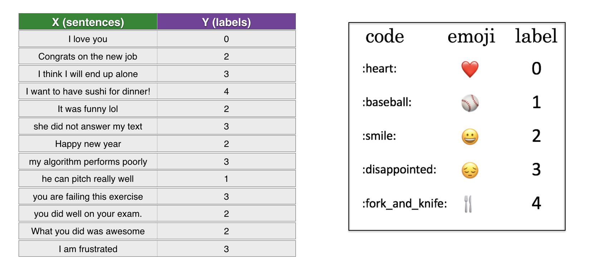
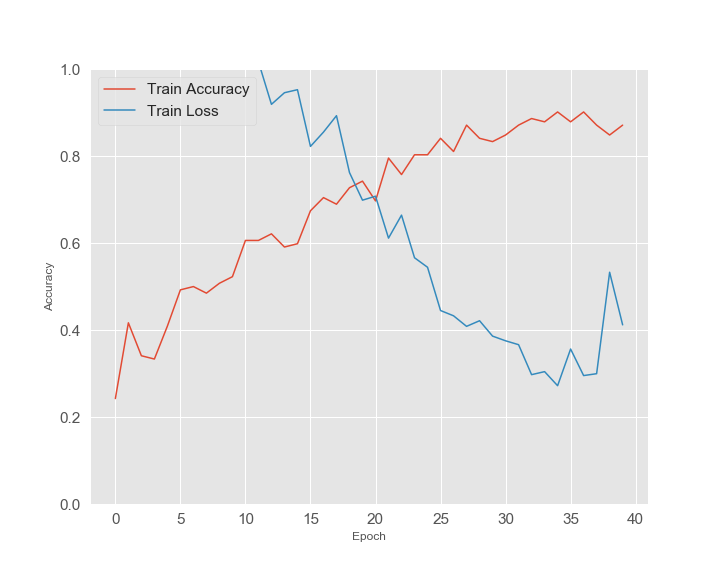
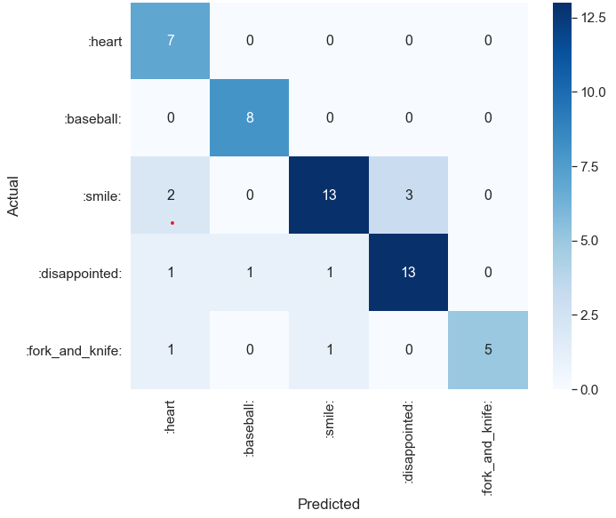

# Emojify!

The goal is put in a sentence a right emoji that expresses a context of the sentence. Using Glove 50-dimensional vector
for word embeddings. Each word has a vector of 50 values that measuring the linguistic or semantic similarity of the corresponding words.

GloVe is an unsupervised learning algorithm for obtaining vector representations for words. 
Training is performed on aggregated global word-word co-occurrence statistics from a corpus, and the resulting representations showcase interesting linear substructures of the word vector space.

Example:
 - Input: ```"Congratulations on the promotion! Let's get coffee and talk. Love you!"```
 - Output: ```"Congratulations on the promotion!👍 Let's get coffee and talk.☕ Love you!❤"```
 
Dataset (X, Y) where:
- X contains 127 sentences (strings).
- Y contains an integer label between 0 and 4 corresponding to an emoji for each sentence.



## Result
```
Epoch 35/100
132/132 [==============================] - 0s 2ms/sample - loss: 0.2720 - accuracy: 0.9015
Epoch 36/100
132/132 [==============================] - 0s 3ms/sample - loss: 0.3564 - accuracy: 0.8788
Epoch 37/100
132/132 [==============================] - 0s 2ms/sample - loss: 0.2953 - accuracy: 0.9015
Epoch 38/100
132/132 [==============================] - 0s 2ms/sample - loss: 0.2996 - accuracy: 0.8712
Epoch 39/100
132/132 [==============================] - 0s 1ms/sample - loss: 0.5329 - accuracy: 0.8485
Epoch 40/100
128/132 [============================>.] - ETA: 0s - loss: 0.4233 - accuracy: 0.8672
Restoring model weights from the end of the best epoch.
132/132 [==============================] - 0s 3ms/sample - loss: 0.4119 - accuracy: 0.8712
Epoch 00040: early stopping
```


Evaluated model on test set
```
Loss = 0.58
Accuracy = 82.14%
```

#### Loss/Accuracy plot


#### Confusin Matrix
